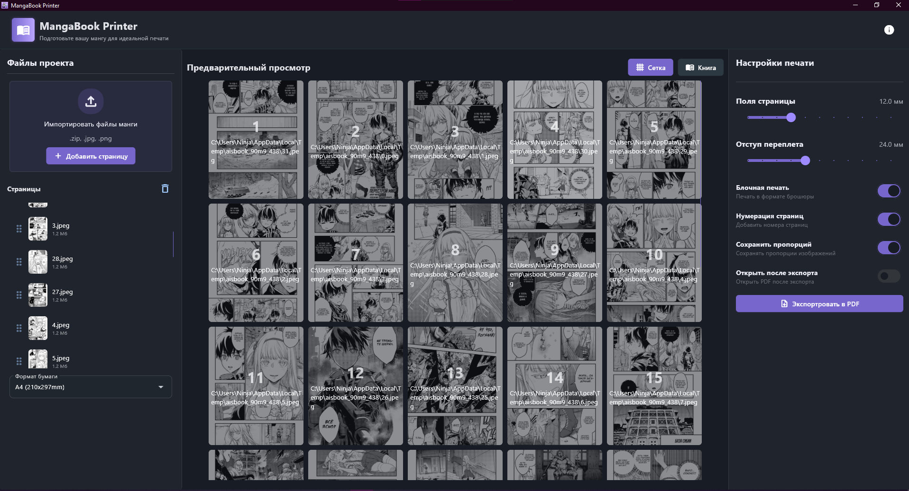
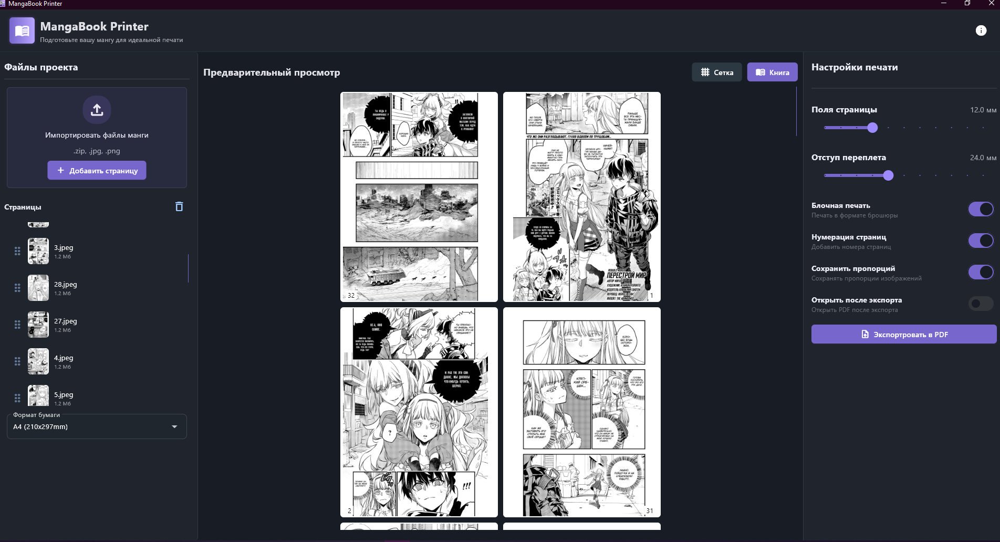
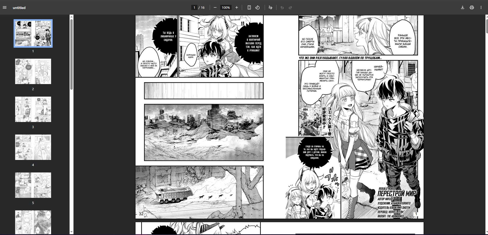

# MangaBook Printer


 **MangaBook Printer**  
Программа для автоматического создания книжного переплета из сканов.  
Загружаете ZIP, PNG или JPG файлы, а программа сама формирует развороты, добавляет нумерацию, регулирует поля и экспортирует готовый PDF для печати.

---

## Особенности

- Автоматическое формирование книжного переплета
- Поддержка форматов: JPG, PNG, ZIP
- Настройка полей переплета и отступов от краев
- Включение нумерации страниц
- Опция сохранения пропорций изображений (`isSavePropety`)
- Экспорт готового PDF в выбранную директорию
- Ускоряет процесс подготовки к печати, избавляя от ручного подсчёта страниц

---

## Скриншоты






---

## Установка и запуск

1. Установите зависимости:

```bash

cd app

pip install -r requirements.txt

````

2. Запуск приложения из исходников:

```bash

python app.py
// или
flet run app.py

```

3. В папке `app/dist` есть уже готовый exe для Windows - можно запускать напрямую.

---

## Требования

* Python 3.10+
* Flet
* ReportLab

Все зависимости указаны в `requirements.txt`.

---

## Лицензия

MIT License - свободное использование и модификации с сохранением имени автора.

---

## Известные ограничения

* Могут встречаться баги при нестандартных форматах изображений
* Пожалуйста, сообщайте о проблемах или предложениях по улучшению

## Контакты

Telegram: [@aisblack](https://t.me/aisblack)

---

## План на будущее

* Возможность печати в тетрадном стиле
* Более гибкая настройка расположения сканов на листе
* Улучшения интерфейса и UX

